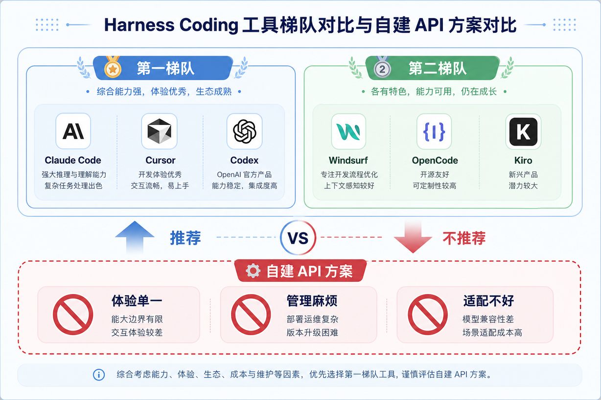
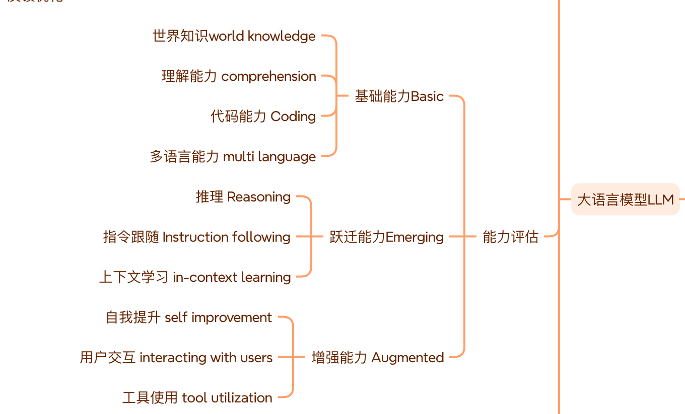

# 0.Harness Coding工具的选择

Harness Coding的工具现在有很多选择

比如第一梯队的（以下是我自己的看法且是亲身使用过的体感排序，仅供参考）

- claude code
- cursor
- codex

第二梯队的

* windsurf
* open code
* kiro

我不建议自己去对接大模型API

理由有三

1. 体验单一

   除非你很有钱或者你背靠一个大公司

   否则在你体验若干不同模型之前

   对接API只会让你坐井观天

   有些时候一些棘手的问题可能从DS切换到Opus一下就解决了

   而只有这些AI IDE或者AI CLI的供应商们有这个实力让你能低成本使用到很多模型

   即使现在限流严重

2. 管理麻烦

   这个不用多说了

   你用三个模型就得对接三套API

3. 适配不好

   自己对接的模型Agent不一定适配

   而工具调用也是其中一项很重要的能力

   好的Agent还会有沙箱机制防止底层模型删库跑路

再说说我自己的工具选择

我去年是cursor的的重度使用者

因为去年cursor的token便宜

即使用完pro的高速池额度

依然可以在慢速池里无限跑任务

几乎一天烧个几千万甚至上亿token都很常见

而我只需要支付每月20刀的费用

后来cursor调整了几次token定价策略后

作为重度使用者的我不得不尝试其他的选择

后来尝试了多款IDE或者CLI后

我到今天大部分时间使用windsurf

偶尔使用codex

而评价一个AI编程工具是否优秀我觉得有以下指标

- 是否能准确理解用户需求（提示词覆写、提示词模板、提供的大模型）
- 是否为大模型提供了一套通用高效的工具调用（MCP、function call、并发调用工具能力）
- 是否足够便宜（token真的很费钱）

当然评价一个大模型也有很多指标

我就不再赘述

感兴趣的话可以看下图

作为一个十年经验的程序猿

我想从体感和性价比而言

现在windsurf给我的感觉相对来说是比较好的

当然这只是我自己的观点

实际你们需要自己去找到自己喜欢的工具即可

后续我们可以通过自己的调优实现本地跨工具不丢用户体验

毕竟每个工具都有一些免费额度

一些简单的任务我们可以通过工具的切换使用来实现