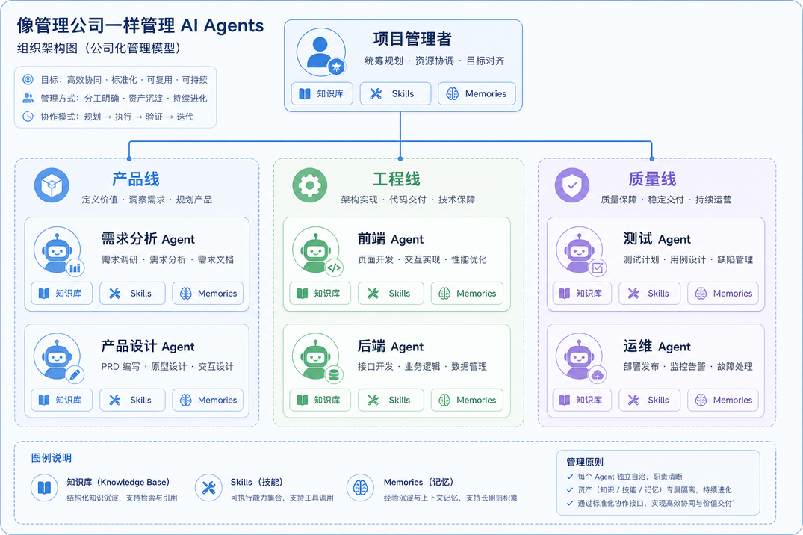
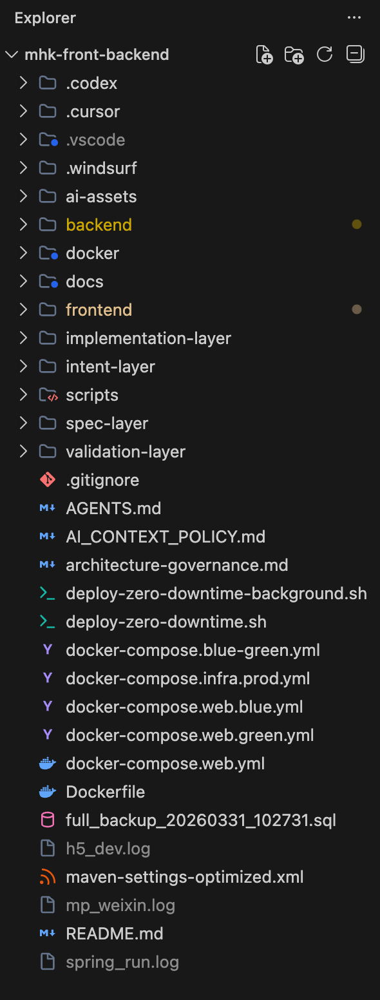
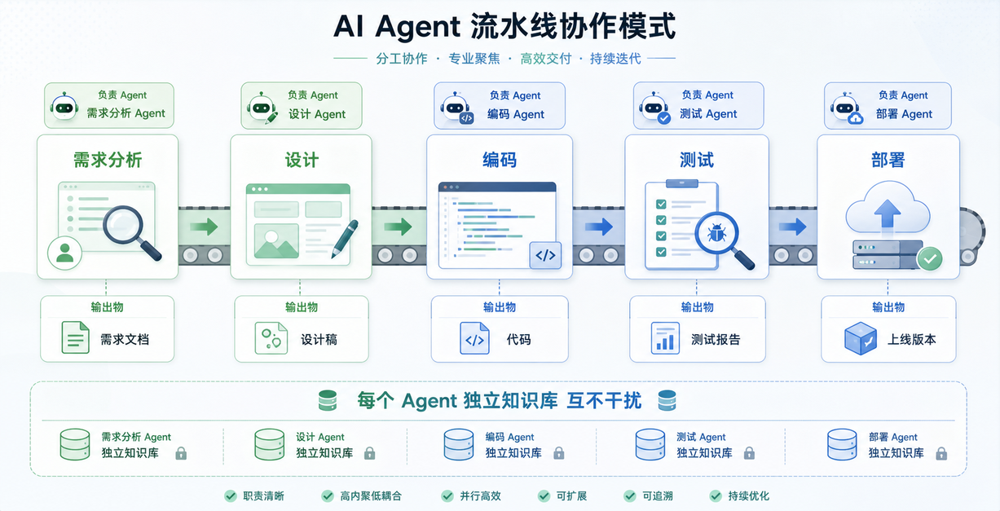

# 1.Harness Coding核心思想

最近OPC（One Person Company即一人公司）的概念炒的比较火

当然我理解的OPC相对来说要狭义一点

即软件行业OPC

为什么提这个概念呢

因为它恰好对应了我的Harness Coding核心思想：

**像管理一个公司一样去管理你的Agents和Harness Coding项目**

为什么要这么做呢？

其实就是一个分而治之的思想

如果只是一个小demo

一个纯前端的网页（现在很多Harness Coding都在做的）

那么我想我们是不需要工程化的东西的

直接告诉AI我们想要什么

然后让它修修改改最后就完工了

但是商业化的大型项目这个明显是不现实的

因为牵一发而动全身

很有可能因为AI的一次小改动

导致关联业务收到影响

或者导致全局的问题产生

并且随着代码量的增多

AI要去处理新的需求会占用越来越多的上下文

最终导致工程变得不可维护

（下图：作者Harness Coding的商业化SaaS项目结构）

所以就像最开始的单体应用发展到一定阶段后

就会有微服务

就会有应用编排

就会有大数据一样

AI Harness Coding到了一定阶段

也需要去做“拆分”

每个业务领域可以建立专属的知识库、Skills、Memories

我们可以像管理一个大型项目的员工一样去管理这些Agents

让他们互相协同但是互不干扰

最终成为一条流水线上的螺丝钉（大厂人应该都有这种感受吧）

所以只有充分了解在一个软件开发从0到1的过程中

有哪些人员角色参与

我们才能将我们的“数字员工”进行合理的拆分

为什么要基于人员角色来拆分呢？

因为AI替代的就是人（sad）

## 从一个软件的诞生史来学 Harness Coding

一般来讲

一个软件的诞生一定是基于市场的需求

“我要”二字

成为了软件诞生的源动力

于是需求分析师BA开始介入

为我们的软件编写需求文档

## 常见的AI工程拆分思路