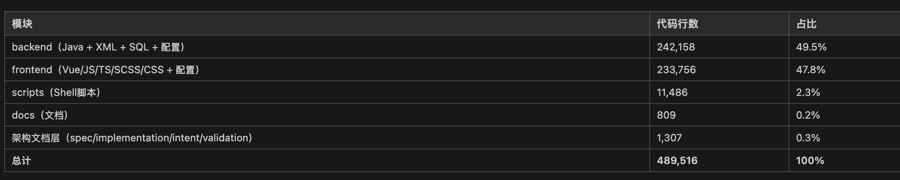

# VibeCraft

一个纯Vibe Coding落地的大型商业项目的知识沉淀

通过这个项目你可以了解到：

- 从零开始构建一个AI Vibe Coding商业化项目的全流程和要素
- Vibe Coding成本控制方法
- 必要的AI Vibe Coding基础知识
- 可能未来AI Coding的标准范式
- 很多可直接使用并且经过实际验证的skills、rules、workflows

适合人群

* 想学习Vibe Coding的同学
* 想Vibe出商业化应用而非小Demo的初创公司或者OPC
* 想要了解AI时代下传统软件应用架构转型的架构师

## 背景

自2025年5月中旬开始

我就开始了我的Vibe Coding科研之旅

那时候还没有现在炒的很火的Harness工程

但是回过头来发现我不断优化和Agent交互的过程其实和Harness如出一辙

期间Vibe Coding了不少项目

做了不少创新性的尝试

得益于模型参数规模的增长

以及不断完善的Vibe Coding工具集和方法论

AI在Vibe Coding的表现中越来越稳定

其中一个项目在历经了约8个月的Vibe Coding后代码量达到了接近50万行

并且上线后已稳定运行了约半年的时间

所以想要将现有的方法论总结一下

一个是方便自己启动新项目的时候能快速boot

另一个则是造福他人

## 指南

本项目的文件夹序号顺序就是推荐阅读顺序

每个文件夹对应一个主题

文件夹下都会有README

直接阅读即可

当然如果你只对例如skills部分感兴趣

你也可以直接阅读和使用skills下的相关资源

## 贡献

欢迎贡献！请查看 [CONTRIBUTING.md](CONTRIBUTING.md) 了解详情。

## 许可证

本项目采用 MIT 许可证 - 详见 [LICENSE](LICENSE) 文件。

## 联系方式

- 项目主页：https://github.com/huanqwer/VibeCraft
- 我的邮箱：huanqwer0314@gmail.com
